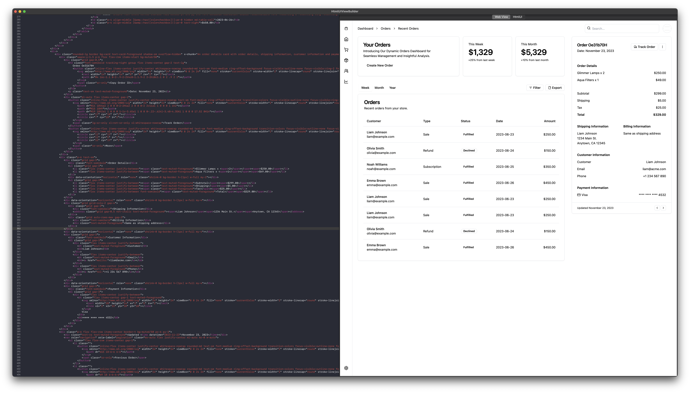

# HtmlUIViewBuilder

A small macOS application to help me convert html code into HtmlUI. Because swift's compiler takes too long to compile an HtmlUI file into somethign that can rendered by a Vapor server, this tool can be used to quickly iterate and create a styled HTML component, get a sense of how it will look in a browser, and then generate you the corresponding HtmlUI file which you have to highlight, copy and paste into your Vapor application.

